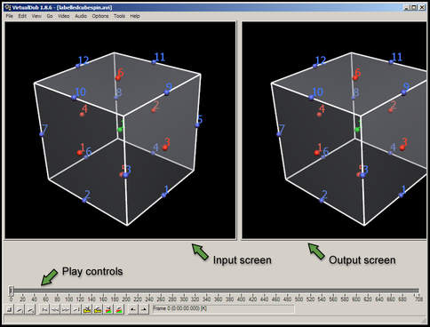
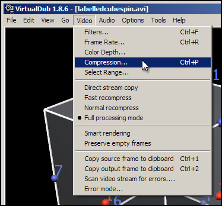
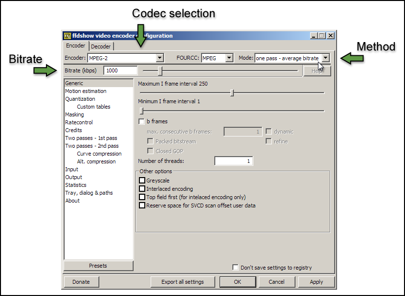
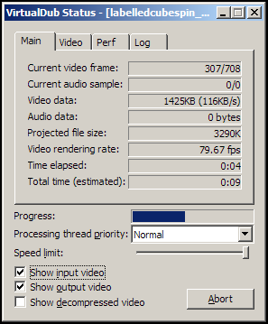

Creating an AVI from a series of images - Windows
=================================================

.. _VirtualDub: http://virtualdub.sourceforge.net/
.. _FFDShow: http://www.free-codecs.com/download/FFDshow.htm
.. _WinFF: http://code.google.com/p/winff/
.. _ffmpeg: http://ffmpeg.mplayerhq.hu/
.. _CamStudio: http://camstudio.org/
.. _graphics window: http://www.cmiss.org/cmgui/wiki/UsingCMGUITheGraphicsWindow

This tutorial will describe a method of compiling a series of images saved from CMGUI into an AVI format movie file on the Windows operating system.  There are other methods, but the one described here can be achieved easily, with free software, and produces excellent and highly customizable results.

An AVI file is a Windows format - however, it can be played on most computers including those running Mac OS X or Linux.  It can also be uploaded to online video sites such as YouTube.

Software used
-------------

The following pieces of software are used in this tutorial - click on the name of the software to navigate to a download page for each item:

* VirtualDub_ - This is an open source AVI editing/capturing application.  For the purposes of this tutorial, it allows you to load in a series of image files as movie frames, and save the resulting movie as an AVI.

* FFDShow_ - This is a Video for Windows and Directshow codec for decoding and encoding a large number of video and audio formats.  With this installed you can save AVI files from VirtualDub using a large range of codecs.

* WinFF_ - This is a free windows front-end to ffmpeg_ (.  This tool allows easy conversion of videos from one format to another.

* CamStudio_ - This is a free open source tool for recording screen activity.  This represents an alternative method for capturing quick movies of CMGUI.

Installation of VirtualDub and FFDShow is a requirement for following this tutorial.  You will need administrator rights on your computer to install FFDShow; VirtualDub is simply unzipped into a directory and run directly.  Camstudio is only required if you wish to experiment with recording the CMGUI `graphics window`_ directly.

Compiling a series of images into a movie
-----------------------------------------

When making a movie from a sequence of images, it is important to make sure that the images you created in CMGUI are saved at a usable resolution. It is always best to use familiar resolutions like 512x384, 640x480, 800x600 or 1024x768. Many video formats require specific resolutions to work properly; codecs often are restricted to multiples of 2, 4, or 8 for both the height and width in pixels.

Creating a movie from a series of images using VirtualDub is very simple:

* Load VirtualDub.  The first time you do this you may be presented with a window where certain options may be set.  You can safely dismiss this window and load VirtualDub.

* Go to the *File* menu and select *Open video file...*. (Ctrl-O)

* Locate and load the first image in your sequence of images.

VirtualDub will automatically load the entire numbered sequence of images in as movie frames, in the correct order.  This works whether you have a 00001-99999 or a 1-99999 style numbering scheme.  You will now see two "screens" side by side, each displaying the first image in your sequence.  This is the first frame of your movie, which can now be played within VirtualDub.  The two screens display the *input* and the *output*.  The *input* screen shows the movie you loaded, in this case the series of frames from the images.  The *output* screen shows the original movie with any filters (such as resizing, contrast adjustments, sharpening etc) that you have applied to it.

   **Figure 1: The main VirtualDub window** This window displays the play controls (which also include marking tools for editing the video), the input and output panels, and the menus.

| 

The next step is to set up the compression and codec settings of the movie you are going to save.

* Go to the *Video* menu and select *Compression...*. (Ctrl-P)

* Select the *ffdshow Video Codec* from the list of codecs.

.. figure:: virtualdub3.png
   :figwidth: image
   :align: center
   
   **Figure 3: Selecting a codec** The codecs listed may differ from those shown here.  Select *ffdshow Video Codec*.

| 

* Notice the *Format restrictions* box on the right hand side - this will inform you of any requirements your selected codec has for input.  For the ffdshow codec, your video resolution must be a multiple of 2 in both width and height.

* Click on the *Configure* button.  This will bring up a window with a range of settings for how the codec will be used to compress your movie.

   **Figure 4: The codec configuration window** This window displays the controls for how the codec will compress your movie.  The ffdshow codec actually enables you to encode your movie in any of a large number of different codecs; the codec is chosen from the *codec selection* drop-down menu.

| 

From this settings window you can set up which codec you wish to use to compress your movie, and how much compression you wish to apply.  Different codecs have different pros and cons; these days it is often best to stick to the more modern codecs, as a majority of computers on all platforms should be able to play them.  Good codecs to choose are MPEG-2, MPEG4, and H.264.  MPEG-2 is an older codec that offers good backwards compatibility, but encodes lower quality videos with larger file sizes.  MPEG4 and its successor H.264 generally offer substantially better quality and/or smaller file sizes.  The following steps will produce an AVI using the MPEG4 codec, which is widely supported.  If you wish to use another codec, the steps are essentially the same.

* Select the *MPEG-4* codec from the codec selection drop-down menu.

* Make sure the *Mode* setting is *one pass - average bitrate*.

* Set the *Bitrate (kbps)* text box to ``1000``.

* Click *Apply* and then *OK*.  Click *OK* in the codec selection window.

* In the main VirtualDub window, go to the *File* menu and select *Save as AVI*.  Enter a name for your movie and click *Save*.

A status window will appear, with some information about the progress of the AVI creation.

   **Figure 5: Progress window**

| 

Once the encoding is finished, find your file and double click on it to play it.  Check the file size, and the quality of the movie.  If the file is too big, change the codec settings to use a lower bitrate and save it again.  If the movie is poor quality, set the bitrate higher and try again. 1000 kbps gives a good quality 640x480 movie in MPEG-4 encoding, with file sizes of about 7 megabytes per minute.  With H264 encoding, bitrates as low as 300kbps can give remarkably good results at 640x480 depending on the content of the movie.

Convert your movie to another format using WinFF
------------------------------------------------

Sometimes you will want to have your movie in a format other than AVI, or you may wish to further tune the compression and quality of your movie.  For example, using the H.264 codec with an AVI creates a non-standard file; it is usually better to encode an mp4 file using H.264.  WinFF is an extremely useful tool for optimizing the file size or quality of your movies, as well as for converting from AVI to other file formats such as mp4 or mov.

When converting using WinFF, it is useful to have an uncompressed movie file to work with.  To create an uncompressed AVI from VirtualDub, select the *Uncompressed RGB/YCbCr* codec when creating the AVI file as detailed above.  

The following steps detail how to encode an H.264 codec mp4 file from an AVI:

* Load WinFF.

* Click on the *Options* button (far right) to show the advanced options.

* Click on the *Add* button, and select the movie file you wish to convert.

* Select *MP4* from the *Convert to...* drop-down menu.

* Select *H.264 in MP4(4:3)* from the preset drop-down menu, to the left of the *Convert to...* drop-down menu.  The 4:3 refers to the aspect ratio of your video; standard sizes such as 320x240, 640x480 or 1024x768 have this aspect ratio.  If your movie has a different aspect ratio, enter it into the *Aspect Ratio* text box, or enter the resolution of your movie directly into the *Video Size* text boxes.

* Enter a value such as ``500`` or ``1000`` into the *Video Bitrate* text box.

* Click on the *Convert* button.

By default, WinFF will create the converted movie file in your My Documents folder.  You may choose a different desination folder for the converted movie by entering a different path in the *Output Folder* text box.
