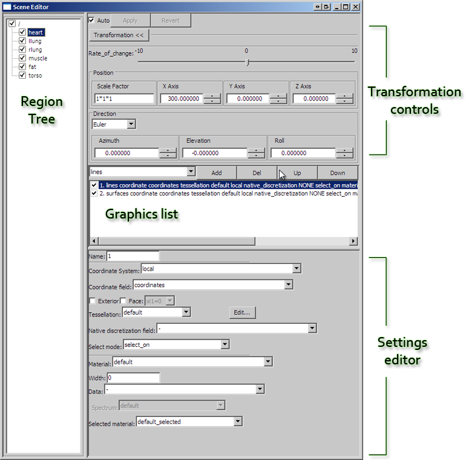

CMGUI Scene Editor Window
=========================

.. _graphics: http://www.cmiss.org/cmgui/wiki/UsingCmguiGraphics

The scene editor is used to control how visualizations appear in the graphics window. From this window you can:

- Toggle visibility for any part of the region tree.
- Toggle visibility of any individual graphics setting for a region.
- Add, remove, and edit graphics.
- Alter the order in which graphics are drawn.

The window itself is broken into four main areas; region tree, transformation controls, graphics list, and settings editor (Figure 1).

   **Figure 1: The scene editor.**

|
|

Region tree
-----------

At the left hand side of the Scene Editor window is the region tree, where all regions are listed. Each region has a visibility toggle, controlled by clicking on the box alongside its name. All ticked regions will be visible in the graphics window, provided that they have some visible graphics. Regions may contain sub-regions, allowing powerful control over visibility of the parts of a complex model.

Alongside the region tree are the transformation settings, graphics list, and settings editor. These are used to control and edit the visualisations of the currently selected region in the region tree.

NOTE:
  Previous versions of cmgui also had a "General Settings" section in this window, which was used to set the level of detail (discretization) of objects. This system has been replaced by the new tessellation object. You are now able to use different levels of detail for different graphics, allowing you to choose the most appropriate for each. This also allows you to change the detail levels of a number of graphics by simply altering a single tessellation object that has been applied to them all. The tessellation is set for each graphical setting using the settings editor.

Graphics list
-------------

Below the transformation and general settings buttons is the *graphics list*.  This is where the visual representations of the currently selected region are listed.  This panel allows creation, deletion, visibility switching (on or off) and re-ordering of these visual representations.

Settings editor
---------------

Below the *graphics list* is the *settings editor* where each graphical setting can be edited.  When a graphical setting is selected from the list, all of its editable properties appear in this area.  The range of editable properties will vary depending on the type of `graphics`_ currently selected.