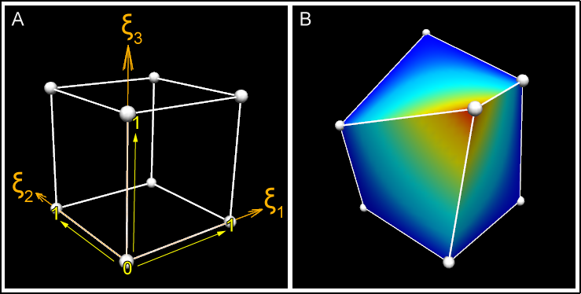
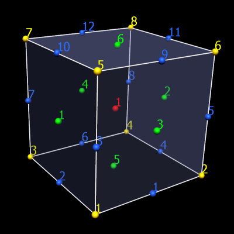
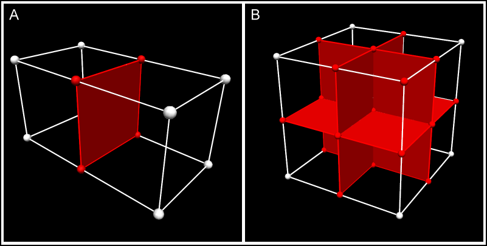

CMGUI Fields
============

.. |xi|     unicode:: U+003BE .. GREEK SMALL LETTER XI
.. |sub1|  unicode:: U+02081 .. SUBSCRIPT ONE
.. |sub2|  unicode:: U+02082 .. SUBSCRIPT TWO
.. |sub3|  unicode:: U+02083 .. SUBSCRIPT THREE
.. _graphical settings: http://www.cmiss.org/cmgui/wiki/UsingCMGUIGraphicalSettings
.. _glyphs: http://www.cmiss.org/cmgui/wiki/VisualizingFieldsAtPointsUsingGlyphs
.. _surfaces: http://www.cmiss.org/cmgui/wiki/VisualizingElementFieldsUsingSurfaces
.. _manifolds: http://en.wikipedia.org/wiki/Manifold

Fields in CMGUI: finite element models
--------------------------------------

CMGUI models are organized into regions, which may contain child regions, so that models can be organized into hierarchies.  The representation of the model within each region is given by *fields*. Much of the power of CMGUI is in its generalized representation and manipulation of fields.  Mathematically, a field is a function returning values at locations within its domain.  Most commonly the values are real numbers, though they may be scalars or multi-component (vectors, tensors etc.).

Consider an object such as a solid cube over which a value like the temperature varies. We would represent this in CMGUI as a field "temperature" which is a function of location in the cube.  A cube is a very simple geometry and it is easy to come up with a simple method to specify any location within it; for example the global x, y, z. But real geometries are seldom simple so we follow the finite element method and divide them up into simple shapes such as cubes, wedges, tetrahedra, etc. for 3D geometries; squares, triangles etc. for 2D geometries; lines for 1D geometries, and other shapes in other dimensions.

These finite elements have a local coordinate system of limited span, which is called an element chart. In cmiss we commonly use the greek character xi with subscript to denote each independent coordinate within an element, hence we will commonly refer to the chart of a given element as its *xi space*. A 3-D cube element in CMISS/CMGUI has a range of 0 to 1 in each xi direction, as shown in figure 1A.

| 

   **Figure 1: Coordinates and xi space of a 3D element.** A) This shows the unit cube xi space, where each dimension of the element ranges from 0-1.  It is easy to imagine that the coordinates of this cube could also be 0-1 in the x, y, and z axes.  B) The cube element in this picture has been distorted, such that its coordinates are no longer 0-1 in the x, y, and z axes.  Despite this, the element's xi values are still 0-1 in each xi direction.  This cube has a "temperature" field that is rendered as a rainbow spectrum.

| 

We must define a coordinate field over the domain in order to give it its true position in 3-dimensional space. This applies even to the simple cube model: it can be treated as a unit cube in xi space, but the coordinate field allows its real position to be transformed such that it is not aligned with the global coordinate system, and in fact can be generally distorted as shown in the figure 1B, above.  About the only thing special about a coordinate field is that - provided it is of the same dimension as the element xi space - it is usually bijective with it - this means if you have one you can find the other, eventually. (I say usually because the relation cannot generally be enforced: it is possible for coordinates of parts of the mesh to penetrate other parts of the mesh, including within a single element where the jacobian is zero or negative.)

A set of finite elements which make up a domain is called a mesh.

In CMGUI data structures we usually also define the faces of elements as separate elements of lower dimension, and share faces between adjacent elements. The faces of 3D "top-level" elements are called face elements, the faces of 2D elements are called line elements. The top-level elements, whether 3D or 2D (or nD) have unique integer element identifiers in their region. Face and line elements also have unique identifiers within their own type; in other words you can have element 1, face 1 and line 1 and they are not the same element.

The zero dimensional counterpart to elements and faces are called nodes. There is one set of nodes per region, again with their own unique integer identifiers. Nodes can be considered as a set of points at which fields are defined. When we define field functions over elements (finite element fields) we most commonly store explicit values and derivatives of the field at nodes and interpolate them across the element. To define such fields each element maintains a list of the nodes which contribute to fields in that element, called the local node list. The number and arrangement of nodes depends very much on the basis function used to compute the field value. Linear Lagrange and simplex basis functions are a simple, common case where nodes contain values of the field at the corners of elements, and these are linearly interpolated in the xi space between. Figure 2 shows the arrangements of faces, lines and nodes (for linear basis) for 3D and 2D elements.

| 

   **Figure 2: How nodes, lines and faces make up a mesh** The simple cube mesh again; nodes (yellow), elements (red), faces (green), and lines (blue) are numbered.  A single cube element requires 8 nodes, 12 lines, and 6 faces.

| 

   **Figure 3: Node, face and line sharing between connected elements** In more complex meshes, connected elements share nodes, lines and faces (shared nodes lines and faces are shown in red).  In panel A, this two-cube mesh has only 12 nodes; 4 of the nodes are shared by both elements.  In panel B, an eight-cube mesh is made up of only 27 nodes - many of the nodes are shared by more than one of the elements.  The central node in this example is shared by all 8 elements.  Field values are continuous across these shared parts.

| 

Getting back to the original statement of what a field is, we can generally state that a domain is a set of 0..N-dimensional manifolds_, i.e. there can be any number of manifolds of any dimension. In CMGUI finite element meshes, nodes supply the point manifolds and elements supply all the higher dimensional manifolds. There is no requirement for the domain to be connected.  CMGUI fields are not limited to returning real numbers; there are fields that can return integers, strings, element-xi locations and other values.

Computed fields
---------------

We have now introduced the main building blocks of finite element fields which are just one type of field representation in CMGUI.  In CMGUI we offer a large number of other field types which do not work directly with finite element meshes, but may be based on finite element fields. Most of these are mathematical operators which act on one or more source fields to produce a new field result.

A simple example is the *add* field which adds two other fields together to return a new field. The add field has two source fields as arguments. If you made field C which added finite element field A to finite element field B, the resulting field is defined over the intersection of the domains of field A and field B.

| 

Other types of field
--------------------

* **Arithmetic and transcendental functions:**

* **Constant fields:** Constant fields have a value which is independent of location within the domain.  You may also have a constant field that is constant (non-varying) across chosen dimension/s but varies across other dimension/s.

* **Composite field:** Makes a new field built from other fields and field components in any order.

* **Image-based fields:** These can be used for texture-mapping and image processing.

* **Many more.**

These types of fields can be created via ``gfx define field`` commands or through the API.  Fields are a modular part of the CMGUI application. If a new function is required, it can be added as a field.  To get a list of the computed fields available in CMGUI, enter ``gfx define field ??`` in the command line.

Fields and visualization
------------------------

When creating visualizations, you need to choose which field controls which part of a graphics object.  Coordinates in one, two or three dimensions can be used to create spatial representations.  Texture coordinate fields can be used to position textures.  Orientation or data fields can be used to position glyphs or colour objects such as surfaces.  CMGUI allows an enormous amount of flexibility in how fields can be visualized.  Further information on visualizations is available in other documents such as those detailing `graphical settings`_, `glyphs`_, or `surfaces`_.

