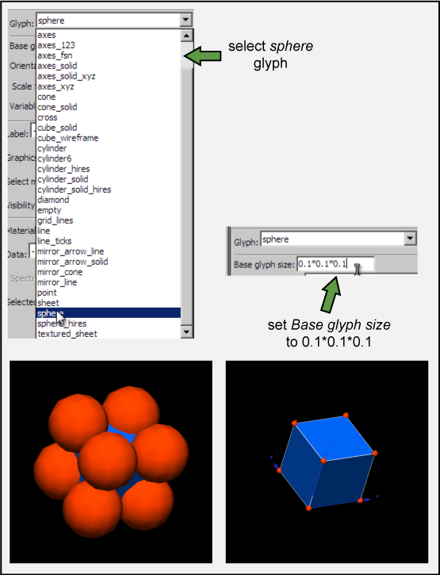
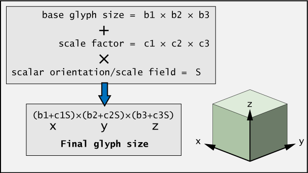
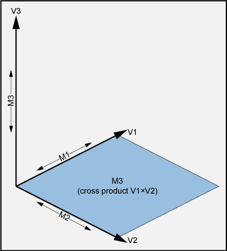

Working With Glyphs
===================

`Adding glyphs to a mesh`_

`Unscaled glyphs`_

`Scalar glyphs`_

`Vector glyphs`_

`Two vector glyphs`_

`Three vector glyphs`_

`Variable scale glyphs`_

Glyphs are graphical objects that are used to represent information at points within a model.  These glyphs can be coloured, scaled, and oriented according to the values of chosen fields.  Glyphs might be used for something as simple as showing node locations, or something more complex such as showing the strain at points within a deformed mesh.  This document will explain how to position, scale and orient glyphs in a variety of ways.

Adding glyphs to a mesh
-----------------------

Glyphs are added and edited from within the scene editor.  When you select a scene object in the scene editor, you can create a new graphical setting for placing glyphs at your points of interest.  Glyphs can be added at node points,  data points, or element points.  Element points are points through the interior of an element at a controllable layout and density.

Unscaled glyphs
---------------

The simplest use of a glyph is to visually mark a point, with no direction or scale information.  Unscaled glyphs are simply glyphs for which you have not selected an *orientation/scale* field.  This means that they simply appear at the points you specify, at the default orientation, and at the base size you specify (the default base size is 1*1*1).  If you want to run through this example, load up example a1 in CMGUI and run the entire com file.

Open the *scene editor* and make sure cube is selected in the *scene object list*.  You will notice that there are three items in the *graphical settings list*: lines, node_points, and surfaces.  Select the node_points graphical settings item.  You will see in the settings below that these node_points already have glyphs associated with them - in the *Glyph* drop-down menu, the glyphs currently used to display the nodes are *point* glyphs.  These are the default glyph, and are by default a single white pixel.  Figure 1 shows the scene editor window, with the three areas labelled.

.. figure:: sceneEditor_Glyphs1.png

   **Figure 1: The scene editor.**

Use the drop-down menu to select another type of glyph for the node points: select *sphere*.  In the graphics window, large orange spheres will appear at the corners (node points) of the cube.  As the cube in this example is 1*1*1 and the default size of the glyphs is also 1*1*1, the glyphs will be far too large to be useful.  For unscaled glyphs, you control the size by entering your desired size in the *Base glyph size* text-box, which will currently contain 1*1*1 (x*y*z dimensions).  Change this to 0.1*0.1*0.1.  If you enter a single value in the base glyph size box, it will use this value for all three dimensions.  After changing the glyphs to these dimensions, you will notice that the spheres have shrunk to a more practical size (Figure 2).  For unscaled glyphs, the final size is determined entirely by the *Base glyph size*.

Final glyph size = b1*b2*b3

   **Figure 2: Changing the glyph and its base size.**

This is the most basic use of glyphs - to indicate points such as nodes.  Other uses of glyphs allow you to represent data in addition to simple location by using the size, shape, and colour of glyphs.

Scalar glyphs
-------------

Scalar glyphs can be used to represent the value of a scalar field at selected points.  They have a single component *orientation/scale* field, which we will call *S*.  The size of each glyph dimension (x, y, and z) is determined by the *base size* (which we will call b) plus the *scale factor* (which we will call c) multiplied by the *orientation/scale* field.

**Figure 3: How glyphs are scaled by a scalar orientation/scale field.**

Any scale factors that are given a zero value do not add anything to the base size - in this way it is possible to scale glyphs in one, two, or three dimensions simply by using a zero value for the dimensions along which you do not wish them to scale.  For example, for glyphs that only scale in the z direction, c1, c2, and c3 could be 0, 0, and 0.1 respectively.  It can also be useful to set the *base size* to zero in order that the final glyph size is exactly proportional to the *orientation/scale* field.

Vector glyphs
-------------

Glyphs used to represent a single vector most often use a 3-component *orientation/scale* field, but it is possible to use a 2 component field for two-dimensional vectors.  The alignment of the glyph is determined by the alignment of the vector defined by the field; the glyph's first direction aligns to the vector, and its second and third directions are arbitrarily aligned orthogonal to this.

The glyph scaling is proportional to the magnitude of the vector, which we will call M.  All three directions of the glyph are scaled by this value.

Final glyph size = (b1+c1M)*(b2+c2M)*(b3+c3M)

In most cases, b1 (base size one) is set to zero so that the final length of the glyphs is directly proportional to M; that is, their size in direction one is entirely determined by the scaling factor c1 multiplied by the magnitude M. Likewise, c2 and c3 can be set to zero so that the width and height of the glyphs are constant; in this case b2 and b3 would be set to the desired constant sizes in these directions.

Two vector glyphs
-----------------

These are very rarely used.  They have either 4 (2D vectors) or 6 (3D vectors) component *orientation/scale* fields.  Vector 1 is defined by the first 2 or 3 components, and vector 2 by the second 2 or 3 components. The glyphs will orient their first direction along vector 1, and their second direction along vector 2.  The glyph's direction 3 direction 3 is equal to the cross product of vectors 1 and 2 (Figure 4)

The glyph scaling is proportional to the magnitude of vector 1 (M1) in direction 1, and the magnitude of vector 2 (M2) in direction 2.

**Figure 3: Scale and orientation factors for two vector glyphs**

M1 = magnitude of vector 1
M2 = magnitude of vector 2
M3 = magnitude of cross product of vectors 1 and 2

Final glyph size = (b1+c1M1)*(b2+c2M2)*(b3+c3M3)

Three vector glyphs
-------------------

Three vector glyphs use a 9 component *orientation/scale* field: vector 1 is defined by components 1,2,3, vector 2 by components 4,5,6, and vector 3 by components 7,8,9.  The scaling along the three directions is determined by the magnitude (M) of the three vectors.

Final glyph size = (b1+c1M1)*(b2+c2M2)*(b3+c3M3)

Using the fibre field
~~~~~~~~~~~~~~~~~~~~~

If you choose fibre field for orientation:
* automatically creates a fibre-axis field from it and coordinate field for display: gfx define field NAME fibre_axes
for 9 component, 3 vector case.

Variable scale glyphs
---------------------

These are used for representing data which contains both magnitude and direction for each of three vectors - for example, strain in a deformed solid.

need both
* direction: orientation_scale field
* magnitude: variable_scale field

========= ============= ============
points    eigen vectors eigen values
========= ============= ============
settings1    v1            lambda1
settings2    v2            lambda2
settings3    v3            lambda3
========= ============= ============

final size = (b1+c1M*lambda1)*(b2+c2M*lambda2)*(b3+c3M*lambda3) for each of the three settings.