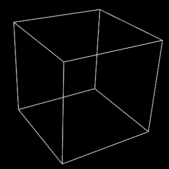
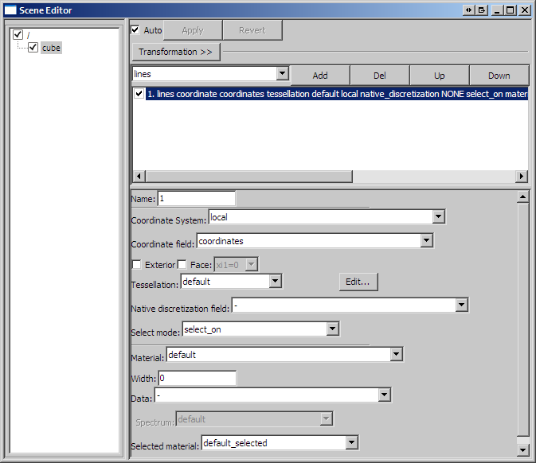

Viewing 2D elements using lines and cylinders
=============================================

*Lines* and *cylinders* are graphical representations which can be used to visualize 2D elements in CMGUI.  In general, lines or cylinders are used to visualize the basic shape of a mesh.  When you load a mesh (exnode and exelem files) into CMGUI, the mesh is by default represented by lines of the default colour and thickness: white lines 1 pixel thick.  This means that a *lines* graphical setting is created in the default scene (see the `scene editor`_), with the default settings (Figure 1).

   **Figure 1: The default graphical setting lines created for a cube mesh.** This mesh was created by reading the ``cube.exnode`` and ``cube.exelem`` files from `example a2`_.

| 

Lines have relatively few settings for altering their appearance (Figure 2).  The following settings are available for lines:

* **Coordinate field:** When you check this box, you are able to select the coordinate field that the lines are drawn according to.  This setting is very rarely used.

* **Exterior:** When this check box is selected, the lines will only be drawn on the exterior faces of a mesh.  This can be useful with large, complex meshes.

* **Face:** Checking this box allows you to select which face of 3D elements is visualized by lines.  Faces are selected according to one of the 3 xi directions of the element, and it's value (either 0 or 1).

* **Select mode:** This drop-down menu allows you to select different selection behaviours for the lines.

  * select_on - The default setting; line elements are able to be selected.
  * no_select - No selection of line elements.
  * draw_selected - only selected lines are drawn.
  * draw_unselected - only unseleted lines are drawn.

* **Material:** This drop down menu allows you to select which material the lines will be rendered as.  Materials are defined in the `material editor window`_.

* **Width:** You can enter a value in this box to set the thickness of the lines in pixels.  This width is independent of zoom, and remains constant through any transformation.  Setting this value to 0 results in lines of 1 pixel wide (the default).

* **Data:** This setting allows you to choose a field which is used to colour the lines according to a spectrum.  Use the *Spectrum* drop-down menu to choose from one of the spectra defined in the spectrum editor window.

* **Selected material:** Use this drop-down menu to select which material will be used to render selected lines.

   **Figure 2: The scene editor settings available for a lines graphical setting.**

| 

*Cylinders* are very similar to lines, with a few additional parameters.  A cylinders graphical setting will draw cylinders along all the same elements that a lines graphical setting would.  Cylinders are different to lines in that they have a size relative to the mesh - therefore they scale with zooming just like other objects that have an actual "size" in the scene.  They have the following settings in addition to those above:

* **Constant radius:** This is the radius of the cylinders, in the same units as the coordinate system.

* **Scalar radius:** This drop-down menu allows you to select a field to scale the radius of the cylinders.  A good example of this is shown in `example a4`_.

* **Scale factors** This box allows you to enter three values as factors for the scaling in three dimensions.  It is possible using this to exaggerate or reduce the scaling, or to restrict scaling to one or two dimensions.

.. _scene editor: http://www.cmiss.org/cmgui/wiki/UsingCMGUITheSceneEditorWindow
.. _material editor window: http://www.cmiss.org/cmgui/wiki/UsingCMGUIMaterialEditor
.. _example a2: http://cmiss.bioeng.auckland.ac.nz/development/examples/a/a2/index.html
.. _example a4: http://cmiss.bioeng.auckland.ac.nz/development/examples/a/a4/index.html