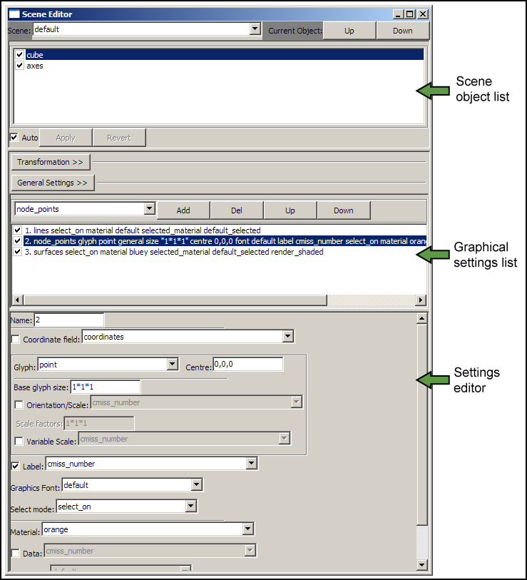

CMGUI Scene Editor Window
=========================

The scene editor is where you control how visualizatons appear in the graphics window.  From this window you can select which graphical representations and settings are displayed.  You can add, remove, and edit visual elements such as lines, glyphs or surfaces; apply materials or spectra to graphical settings; and alter the order in which graphical representations are drawn.  The window itself is broken into three main panels - the scene objects list, graphical settings list, settings editor (Figure 1)

   **Figure 1: The scene editor.**
   
| 
| 

Scene object list
-----------------

| At the top of the scene objects list is a drop-down menu which usually contains the word *default*.  This is the scene selection menu, which you can use to swap between scenes.  The *default* scene is present when you load CMGUI, and is the default scene in which scene objects are created.  There are *up* and *down* buttons to the right of this menu, which allow you to change the order of the objects in the *scene object list*.  This is important when using transparent objects to ensure they are correctly rendered.

Below the *scene object list*  Is the *transformation* button.  This button will open up a set of controls that allow you to spatially manipulate the selected scene object.  From these controls you can scale, translate or rotate the object within the scene.

If a scene object made up of elements is selected, the *general settings* button will become available.  This button opens a series of settings that allow you to edit the coordinate field and discretisation options for the selected object.

Graphical settings list
-----------------------

Below the transformation and general settings buttons is the *graphical settings list*.  This is where the visual representations (graphical settings) of the currently selected scene object are listed.  This panel allows creation, deletion, visibility switching (on or off) and re-ordering of these visual representations.

Settings editor
---------------

Below the *graphical settings list* is the *settings editor* where each graphical setting can be manipulated.  When a graphical setting is selected from the list, all of its editable properties appear in this area.  The range of editable properties will vary depending on what sort of graphical setting is currently selected.