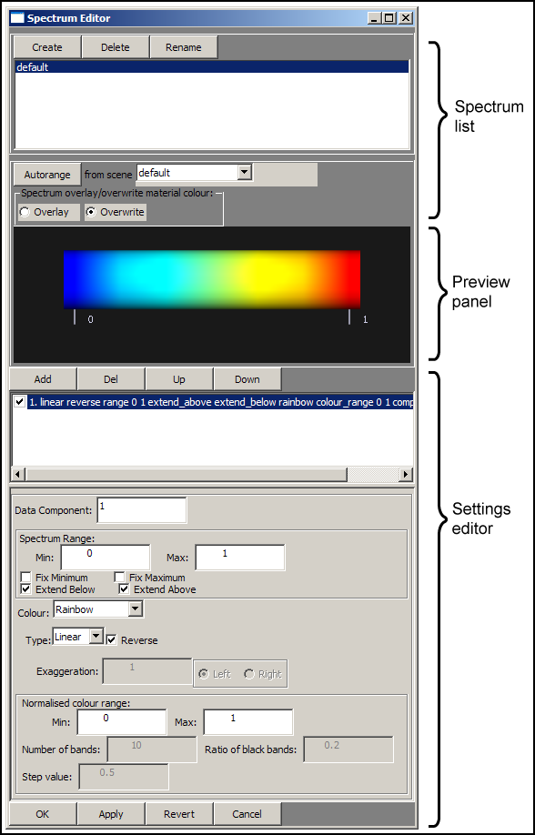

CMGUI Spectrum Editor Window
============================

.. _graphical settings: http://www.cmiss.org/cmgui/wiki/UsingCMGUIGraphicalSettings
.. _example a7: http://cmiss.bioeng.auckland.ac.nz/development/examples/a/a7/index.html
.. _example ak: http://cmiss.bioeng.auckland.ac.nz/development/examples/a/ak/index.html
.. _scene editor: http://www.cmiss.org/cmgui/wiki/UsingCMGUITheSceneEditorWindow

The spectrum editor window is where you define spectra to be applied to graphical elements or objects in the graphics window.  Spectra are used to visualize continuous data ranges within models using colour ranges, and can be applied to the `graphical settings`_ that have been used to create your visualization.  The window is divided into three basic areas; the spectrum list, the preview panel, and the settings editor (Figure 1).

   **Figure 1: The spectrum editor.**

| 

It is useful to step through `example a7`_ to get a feel for the use of spectra in CMGUI.  This example uses a mesh containing a number of fields that can be usefully visualized using spectra.

Spectrum List
-------------

The spectrum list shows all the currently defined spectra; it will always contain the *default* spectrum if no others have been defined.  Three buttons at the top of the window allow you to *create*, *delete*, or *rename* spectra.  Just below the list of spectra are some controls that allow you to set some of the general properties of the selected spectrum.  The *autorange* button automatically sets the minimum and maximum values of the selected spectrum, according to the smallest and largest values it has been applied to in the `scene editor`_.  For example, if the default spectrum has been used to colour a temperature field in the default scene, and that field has values ranging from 0 to 100 degrees Celsius, pressing the *autorange* button will set the minimum and maximum values (in the *Spectrum range* settings - see below) of the selected spectrum to 0 and 100 respectively.  If the selected spectrum has been used to colour objects according to more than one field, the *autorange* function will choose the smallest and largest values across all of these fields.  The *from scene* drop-down menu allows you to select the scene from which the spectrum will be auto-ranged.

The *overlay* or *overwrite* options allow you to choose whether a spectrum will completely over-ride any other material settings (*overwrite*), therefore completely colouring the object as the spectrum appears in the preview panel - or whether the spectrum combines with the other material settings of the object so that the final colour is a combination of the spectrum and other material settings (*overlay*).

| 

Preview Panel
-------------

This panel shows a horizontal bar, coloured using the selected spectrum.  The bar also shows the range that the spectrum is currently set to, using a series of numbered labels.  Clicking in the preview panel changes the number of these labels from 4 to 10 to 2, then cycles through these values.  Currently the preview panel can not display multi-component spectra.

Settings Editor
---------------

The settings editor is where each spectrum is set up.  It contains a number of controls.

* **Spectrum component list:**  The top of this list has four buttons; *Add*, *Delete*, *Up*, and *Down*.  Below these buttons is a list of the components that make up the selected spectrum.  Spectra in CMGUI can be made up of multiple components; these can be added, deleted or re-ordered using this list.  Using these "sub-spectra" you are able to create spectra that have different colour ranges for different parts of the data range they cover, or spectra that have different colour ranges for different dimensions.

* **Data component:** This text box allows you to enter which data component of a multi-component field the spectrum will colour according to.

* **Spectrum range:** This set of controls is used to set up the range of values the spectrum covers.  The *Min.* and *Max.* text boxes allow you to enter values for the minimum and maximum values of the spectrum.  There are also four check boxes that allow you to change the behaviour of a spectrum at its start and end points.

* **Colour:** This drop-down menu provides a selection of pre-set colour settings that can be applied to the currently selected spectrum component.  Although many of the colour ranges are fairly self-explanatory, a number of them have special features which are useful for creating specialized spectra.  The *contour bands* and *step* colour settings have further settings associated with them.

  * Rainbow: This is a standard rainbow colour range.
  * Red: This is a red to black colour range.  It is applied as a single "channel" of red to the spectrum; this can be used to add to other spectrum components to make multi-component spectra.
  * Green: This is a single channel green to black colour range.
  * Blue: This is a single channel blue to black colour range.
  * White to blue: This is a white to blue colour range.
  * White to red: This is a white to red colour range.
  * Monochrome: This is a black to white colour range.
  * Alpha: This is a single channel transparent to opaque spectrum.
  * Contour bands: This colour option creates a series of evenly spaced black bands that can be further edited to get the correct number, width and spacing desired.
  * Step: This is a colour range which has a sharp transition from saturated red to saturated green.

* **Type:** This drop down menu allows you to choose between linear and log scale spectra.  The *Reverse* check box allows you to swap the direction of the spectrum.  If a log scale is selected as the type, the *Exaggeration* settings become available.

  * Exaggeration: This text box allows you to specify how strongly the spectrum is exaggerated.
  * Left/Right: These radio buttons allow you to choose the direction of the exaggeration.

* **Normalised colour range:** These two text boxes allow you to specify the portion of the colour range that is displayed across the chosen range of values for the spectrum component.  The default values of 0 and 1 display the entire colour range, and other values allow you to choose where in the colour range the spectrum component begins and ends. For example, 0.5 and 1 would display only the upper half of the colour range; 0 and 0.5 would display only the lower half; 0.25 and 0.75 would display the middle section of the colour range.

* **Number of bands:** This text box is enabled when the *contour bands* colour type is chosen.  Enter a value to specify the number of contour bands.

* **Step value:** This text box is enabled when the *step* colour type is chosen.  Enter a value somewhere between the values specified in *Spectrum range* to specify where the step occurs in the spectrum.

