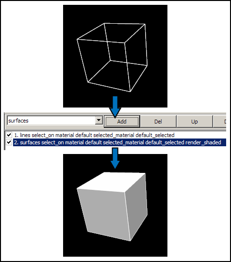

Visualizing element fields using surfaces
=========================================

.. _scene editor: http://www.cmiss.org/cmgui/wiki/UsingCMGUITheSceneEditorWindow
.. _graphical settings: http://www.cmiss.org/cmgui/wiki/CMGUIGraphicalSettings
.. _graphics window: http://www.cmiss.org/cmgui/wiki/UsingCMGUITheGraphicsWindow

*Surfaces* and *iso-surfaces* are graphical representations that can be used to represent two or three dimensional elements in CMGUI.  Surfaces can be used to represent the faces of a 3D element or mesh, for example.  Isosurfaces connect all the points in a three dimensional space that have some value in common.

Surfaces and iso-surfaces are created as `graphical settings`_ in the `scene editor`_.  To create a very simple surface graphical setting, go to the *File* menu, select *Read*, then *Node file*.  Read in ``cube.exnode`` from the example a2 directory.  Then using the *Read* and *Elements file* menu options, read in ``cube.exelem`` from the same directory.  If you now create a `graphics window`_, you will see a simple cube rendered in the default lines graphical setting.  Open the `scene editor`_ window by selecting it from the *Graphics* menu.  Select the *cube* scene object, then in the graphical settings panel select *surfaces* in the drop-down menu.  Click the *Add* button to the right of this menu.  A new graphical setting will appear in the list, below the lines graphical setting.  In the 3D window, your cube will now be rendered with white shaded surfaces.

| 

   **Figure 1: Adding surfaces to a mesh** Using the example a2 cube, adding a surface graphical setting creates a basic surface in the default material (white).

| 

The *element discretization* setting in the *general settings* area of the `scene editor`_ determines the detail level of surfaces.  Each face in a surface graphical setting is divided into a number of squares (each made up of two triangles) determined by this discretization setting.  The discretization can be independently set for each of the three coordinate dimensions, allowing you to set different detail levels for different parts of surface.

